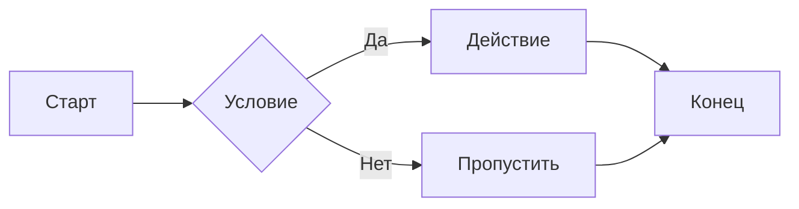
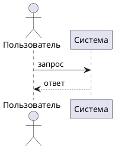

# Руководство по оформлению Markdown-документов для DocGen

> **Назначение документа.** Этот файл описывает правила и синтаксис, которым должен следовать Markdown-текст, подаваемый на вход системе генерации документов DocGen. Система конвертирует Markdown в DOCX или PDF через Pandoc 3.x с набором фильтров. Нарушение правил приводит к некорректному форматированию, сломанным ссылкам или ошибке конвертации.

---

## 1. Общая структура документа

### 1.1 YAML-заголовок (front matter)

Документ **может** начинаться с YAML-блока, отделённого тройным дефисом. Заголовок не обязателен, но рекомендуется при использовании перекрёстных ссылок.

```markdown
---
title: "Название документа"
author: "Автор"
date: "2026-03-06"

# Настройки pandoc-crossref (используются только если включена опция «Перекрёстные ссылки»)
figureTitle: "Рисунок"
tableTitle: "Таблица"
listingTitle: "Листинг"
figPrefix: "рис."
tblPrefix: "табл."
eqnPrefix: "формула"
autoSectionLabels: true
---
```

- YAML-блок обязан быть **первым элементом** документа — перед ним не должно быть ни одной пустой строки и никакого текста.
- Ключи `figureTitle`, `tableTitle`, `figPrefix`, `tblPrefix`, `eqnPrefix` локализуют метки перекрёстных ссылок. Без них метки будут на английском.
- Если перекрёстные ссылки не используются, YAML-блок можно опустить.

### 1.2 Кодировка и язык

- Файл должен быть в **UTF-8** без BOM.
- Для русскоязычных документов перевод строк — LF или CRLF, оба варианта допустимы.

---

## 2. Заголовки

Используется синтаксис ATX (решётки):

```markdown
# Заголовок 1-го уровня

## Заголовок 2-го уровня

### Заголовок 3-го уровня

#### Заголовок 4-го уровня
```

**Правила:**

- После `#` всегда ставится **один пробел** перед текстом.
- Между заголовком и следующим абзацем — **одна пустая строка**.
- Не пропускайте уровни: если есть `##`, то `#` должен был быть раньше.
- Не используйте подчёркивающий синтаксис (`===` / `---`) — он ненадёжно распознаётся.
- Заголовок 1-го уровня (`#`) в документе, как правило, **один** — это заголовок всего документа.

---

## 3. Абзацы и перенос строк

```markdown
Это первый абзац. Он может занимать несколько строк в исходнике,
но в документе они будут объединены в один абзац.

Пустая строка начинает новый абзац.

Вот ещё один абзац.
```

**Жёсткий перенос строки** внутри абзаца: строка, заканчивающаяся двумя пробелами или обратным слешем `\`, даёт перенос строки без нового абзаца.

```markdown
Строка первая  
Строка вторая (с мягким переносом)
```

> ⚠️ Система включает расширение `hard_line_breaks` — **каждый** перенос строки в исходнике становится переносом строки в документе. Если вы хотите слить строки в один абзац, не переносите их в исходнике.

---

## 4. Текстовое форматирование

| Эффект | Синтаксис | Результат |
|---|---|---|
| Жирный | `**текст**` или `__текст__` | **текст** |
| Курсив | `*текст*` или `_текст_` | *текст* |
| Жирный курсив | `***текст***` | ***текст*** |
| Зачёркнутый | `~~текст~~` | ~~текст~~ |
| Инлайн-код | `` `код` `` | `код` |
| Верхний индекс | `x^2^` | x² |
| Нижний индекс | `H~2~O` | H₂O |

**Запрещено:**
- HTML-теги (`<b>`, `<i>`, `<span>` и т.д.) — **удаляются** бэкендом до конвертации.
- Прямые CSS-стили и атрибуты HTML.

---

## 5. Списки

### 5.1 Маркированный список

```markdown
- Первый элемент
- Второй элемент
  - Вложенный элемент (отступ 2 пробела)
  - Ещё вложенный
- Третий элемент
```

- Маркер: дефис `-`, звёздочка `*` или плюс `+`. В пределах одного списка используйте **один и тот же** маркер.
- Вложенность — 2 пробела на уровень.
- Перед списком и после него — **пустая строка**.

### 5.2 Нумерованный список

```markdown
1. Первый пункт
2. Второй пункт
3. Третий пункт
   1. Вложенный нумерованный (3 пробела)
   2. Ещё один
4. Четвёртый пункт
```

- Номера в исходнике не важны — Pandoc перенумерует автоматически. Можно писать `1.` везде.
- При включённой опции **«Native numbering»** (рекомендуется) Word использует собственный механизм нумерации — список корректно обновляется при редактировании DOCX.

### 5.3 Список с абзацами

Если элементы списка разделены пустыми строками, они становятся «свободными» абзацами:

```markdown
- Первый элемент.

  Продолжение первого элемента — второй абзац этого пункта.

- Второй элемент.
```

> ⚠️ Расширение `lists_without_preceding_blankline` включено — список начинается без предшествующей пустой строки. Однако **после** предыдущего абзаца перед списком рекомендуется оставлять пустую строку для ясности.

---

## 6. Таблицы

### 6.1 Базовый синтаксис

```markdown
| Столбец 1 | Столбец 2 | Столбец 3 |
|-----------|:---------:|----------:|
| Лево      |   Центр   |     Право |
| Данные    |   Данные  |    Данные |
```

- `|---|` — выравнивание по левому краю (по умолчанию).
- `|:---:|` — по центру.
- `|---:|` — по правому краю.
- Разделительная строка `|---|` **обязательна**.

### 6.2 Подпись таблицы

Подпись добавляется **после** таблицы строкой, начинающейся с `: `:

```markdown
| Параметр | Значение | Единица |
|----------|----------|---------|
| Скорость | 100      | км/ч    |
| Масса    | 1500     | кг      |

: Технические характеристики автомобиля
```

При включённой опции **«Перекрёстные ссылки»** подпись с идентификатором:

```markdown
: Технические характеристики {#tbl:car-specs}
```

### 6.3 Широкие таблицы

Для таблиц с длинным содержимым используйте grid-таблицы Pandoc:

```markdown
+----------+------------------------------------------+
| Параметр | Описание                                 |
+==========+==========================================+
| Первый   | Длинное описание первого параметра,      |
|          | занимающее несколько строк.              |
+----------+------------------------------------------+
| Второй   | Описание второго параметра.              |
+----------+------------------------------------------+

: Подробное описание параметров {#tbl:params}
```

---

## 7. Изображения

### 7.1 Базовая вставка

```markdown

```

- Путь к файлу — **относительный**, от корня загруженной папки с изображениями.
- Подпись — обязательна (иначе это не «рисунок», а просто inline-изображение).
- Допустимые форматы: PNG, JPG/JPEG, SVG, GIF, WebP, BMP, TIFF.

### 7.2 Размеры

По умолчанию включён авто-масштаб (Lua-фильтр `image-scale.lua`): изображения без явного размера растягиваются до **полной ширины текста**. Чтобы задать конкретный размер:

```markdown
{width=40%}

{width=12cm}

{width=48px height=48px}
```

Допустимые единицы: `%` (от ширины текста), `cm`, `mm`, `in`, `px`, `pt`.

> ✅ Для технических документов рекомендуется `{width=80%}` — небольшой отступ от полей.

### 7.3 Перекрёстные ссылки на рисунки

При включённой опции **«Перекрёстные ссылки»**:

```markdown
{#fig:arch width=90%}

Как показано на [@fig:arch], система состоит из трёх компонентов.
```

- Идентификатор начинается с `#fig:`.
- Ссылка: `[@fig:имя]`.
- Несколько ссылок: `[@fig:arch; @fig:flow]`.

---

## 8. Формулы

### 8.1 Инлайн-формулы

Формула в тексте — в одиночных знаках доллара:

```markdown
Скорость вычисляется по формуле $v = s / t$, где $s$ — расстояние, $t$ — время.
```

> ⚠️ Пробел перед закрывающим `$` **не допускается**: `$ v $` не будет распознано как формула.

### 8.2 Блочные (выключные) формулы

Формула на отдельной строке — в двойных знаках доллара. Перед и после — **пустые строки**:

```markdown
Уравнение Эйлера:

$$e^{i\pi} + 1 = 0$$

Интеграл Гаусса:

$$\int_{-\infty}^{+\infty} e^{-x^2}\,dx = \sqrt{\pi}$$
```

При включённой опции **«Стиль Equation для формул»** (DOCX) каждая блочная формула оборачивается в абзац с Word-стилем «Equation» из шаблона.

### 8.3 Перекрёстные ссылки на формулы

```markdown
$$F = ma$$ {#eq:newton}

Из второго закона Ньютона [@eq:newton] следует, что...
```

- Идентификатор ставится **после** `$$` на той же строке: `$$ формула $$ {#eq:имя}`.
- Ссылка: `[@eq:имя]`.

### 8.4 Поддерживаемый синтаксис LaTeX

Используется стандартный LaTeX Math. Примеры:

```
Дроби:          \frac{числитель}{знаменатель}
Корни:          \sqrt{x},  \sqrt[n]{x}
Степени:        x^{2},  x^{n+1}
Индексы:        x_{i},  a_{ij}
Суммы/произв.:  \sum_{i=1}^{n},  \prod_{k=0}^{\infty}
Интегралы:      \int_a^b,  \iint,  \oint
Греческие:      \alpha, \beta, \gamma, \Gamma, \Delta, \Omega
Матрицы:        \begin{pmatrix} a & b \\ c & d \end{pmatrix}
Системы:        \begin{cases} x+y=1 \\ x-y=0 \end{cases}
Скобки:         \left( \frac{a}{b} \right),  \left[ ... \right]
Операторы:      \cdot, \times, \div, \pm, \leq, \geq, \neq, \approx
```

---

## 9. Блоки кода

### 9.1 Фenced code block

````markdown
```python
def factorial(n: int) -> int:
    if n <= 1:
        return 1
    return n * factorial(n - 1)
```
````

- Указание языка после открывающих `` ``` `` включает подсветку синтаксиса (при включённой опции в UI).
- Поддерживаемые языки: `python`, `javascript`, `typescript`, `java`, `c`, `cpp`, `csharp`, `go`, `rust`, `sql`, `bash`, `shell`, `yaml`, `json`, `xml`, `html`, `css`, `markdown`, `latex` и многие другие.
- Без указания языка — моноширинный текст без подсветки.

### 9.2 Инлайн-код

```markdown
Функция `os.path.join()` объединяет части пути.
```

### 9.3 Подпись к листингу (с crossref)

````markdown
```python
x = 42
```
: Пример присваивания {#lst:example}

Листинг [@lst:example] демонстрирует...
````

---

### 9.4 Диаграммы Mermaid и PlantUML

Бэкенд автоматически находит фenced-блоки с типами `mermaid` и `plantuml`, рендерит их в PNG через локальный сервис [Kroki](https://kroki.io/) и подставляет изображение до передачи в Pandoc. Никакой дополнительной настройки не требуется.

#### Mermaid

````markdown

````

Поддерживаемые типы Mermaid-диаграмм: `flowchart`, `sequenceDiagram`, `classDiagram`, `stateDiagram-v2`, `erDiagram`, `gantt`, `pie`, `gitGraph` и другие.

#### PlantUML

````markdown

````

Поддерживаются все типы PlantUML: sequence, class, component, activity, use case, state, deployment и т.д.

#### Размер диаграммы

Сгенерированное PNG вставляется как обычное изображение и подчиняется правилам раздела **7**. По умолчанию Lua-фильтр `image-scale.lua` растягивает его до полной ширины текста. Для явного ограничения используйте атрибут `width` — но он задаётся на уровне изображения, а не кодового блока. Обходной вариант — вставить диаграмму как отдельный файл и сослаться на него вручную (раздел **7.2**).

#### Правила и ограничения

- Тип указывается **сразу** после открывающих `` ``` `` без пробелов: `` ```mermaid `` или `` ```plantuml ``.
- Регистр не важен: `Mermaid`, `PLANTUML` тоже работают.
- Диаграммы рендерятся **конкурентно** — несколько блоков не увеличивают время генерации линейно.
- Если сервис Kroki недоступен (например, при первом запуске контейнеров), в документ вставляется предупреждение и **оригинальный блок сохраняется** — генерация документа не прерывается.
- Не используйте HTML-теги внутри исходника диаграммы — они удаляются ещё до рендеринга.

---

## 10. Перекрёстные ссылки (pandoc-crossref)

> Опция **«Перекрёстные ссылки»** в UI должна быть включена.

### 10.1 Сводная таблица синтаксиса

| Объект | Задать идентификатор | Сослаться |
|--------|---------------------|-----------|
| Рисунок | `{#fig:id}` | `[@fig:id]` |
| Таблица | `: Подпись {#tbl:id}` | `[@tbl:id]` |
| Формула | `$$...$$ {#eq:id}` | `[@eq:id]` |
| Листинг | `: Подпись {#lst:id}` | `[@lst:id]` |
| Раздел | `## Заголовок {#sec:id}` | `[@sec:id]` |

### 10.2 Правила именования идентификаторов

- Только латинские буквы, цифры, дефис, подчёркивание: `fig:arch-diagram`, `tbl:results-2026`.
- Идентификаторы **уникальны** в пределах документа.
- Регистр чувствителен: `fig:Arch` ≠ `fig:arch`.

### 10.3 Несколько ссылок

```markdown
Как показано на рисунках [@fig:arch; @fig:flow], система...

Данные в таблицах [@tbl:input; @tbl:output] взяты из эксперимента.
```

### 10.4 Диапазон ссылок

```markdown
Рисунки [@fig:step1]–[@fig:step3] иллюстрируют процесс.
```

---

## 11. Ссылки и цитирование

### 11.1 Внешние ссылки

```markdown
[Текст ссылки](https://example.com)

<https://example.com>
```

### 11.2 Якорные ссылки на разделы документа

```markdown
Подробнее в [разделе об архитектуре](#архитектура-системы).
```

Якорь формируется из текста заголовка: строчные буквы, пробелы → `-`, спецсимволы удаляются.

### 11.3 Сноски

```markdown
Текст с примечанием[^1].

[^1]: Текст сноски. Может быть многострочным
      при отступе 6 пробелов.
```

---

## 12. Цитаты и выноски

### 12.1 Блочная цитата

```markdown
> Это блочная цитата.
> Она может занимать несколько строк.
>
> И несколько абзацев.

> **Важно:** особое примечание, которое нужно выделить.
```

### 12.2 Вложенные цитаты

```markdown
> Внешний уровень.
>
> > Вложенный уровень.
```

---

## 13. Горизонтальный разделитель

```markdown
---
```

Три или более дефисов на отдельной строке. Результат — горизонтальная линия в документе.

> ⚠️ Не путать с разделителем YAML-блока. YAML-блок `---` допустим только в самом начале документа.

---

## 14. Многоколоночные метаданные и атрибуты Pandoc

Pandoc поддерживает расширенные атрибуты для заголовков:

```markdown
## Раздел с идентификатором {#sec:intro .unnumbered}
```

- `{#id}` — устанавливает ID для crossref.
- `.unnumbered` — исключает раздел из автонумерации (при включённой опции «Нумерация разделов»).
- `.unlisted` — исключает раздел из оглавления.

---

## 15. Ограничения и запреты

### 15.1 Запрещённые конструкции

| Конструкция | Причина |
|-------------|---------|
| `<b>текст</b>`, `<i>`, `<span>` и любые HTML-теги | Удаляются бэкендом ещё до передачи в Pandoc |
| `<div>`, `<p>`, `<table>` | Аналогично |
| `style="..."`, `class="..."` | Атрибуты HTML-тегов, удаляются вместе с тегами |
| `\newpage`, `\clearpage` (LaTeX-команды вне формул) | Не поддерживаются в DOCX; для PDF работают, но нежелательны |
| Markdown внутри HTML-блоков | Не обрабатывается |

### 15.2 Ограничения таблиц

- Не поддерживаются **объединённые ячейки** (colspan/rowspan) в синтаксисе Pipe Tables. Используйте Grid Tables для сложных случаев, но объединение ячеек всё равно не гарантируется.
- Таблицы без заголовка: если заголовок не нужен, используйте Pandoc headerless tables — строка из дефисов без заголовочной строки (но поведение зависит от шаблона).

### 15.3 Ограничения изображений

- Пути к изображениям должны быть **относительными** и не выходить за пределы загруженной папки (`../` не разрешается).
- Изображения, на которые нет ссылок в тексте, **не попадают** в документ.
- Максимальный общий объём изображений не ограничен явно, но большой объём увеличивает время генерации.

### 15.4 Вложенное форматирование

Не используйте форматирование **внутри идентификаторов** crossref:

```markdown
# Правильно
{#fig:schema}

# Неправильно (дефис в идентификаторе — допустим, пробел — нет)
{#fig:моя схема}
```

---

## 16. Примеры целых секций

### Пример 1: Техническая глава с рисунком и формулой

```markdown
## Математическая модель {#sec:math-model}

Движение тела описывается вторым законом Ньютона:

$$F = ma$$ {#eq:newton}

где $F$ — результирующая сила (Н), $m$ — масса тела (кг), $a$ — ускорение (м/с²).

Из [@eq:newton] следует, что при постоянной силе ускорение обратно пропорционально массе.

Схема сил представлена на [@fig:forces]:

{#fig:forces width=70%}
```

### Пример 2: Секция с таблицей

```markdown
## Результаты измерений {#sec:results}

Сводка результатов приведена в [@tbl:measurements].

| Опыт | Масса, кг | Сила, Н | Ускорение, м/с² |
|:----:|----------:|--------:|----------------:|
| 1    | 2,0       | 10,0    | 5,00            |
| 2    | 4,0       | 10,0    | 2,50            |
| 3    | 1,0       | 10,0    | 10,00           |

: Результаты трёх опытов {#tbl:measurements}

Все результаты соответствуют теоретической модели [@eq:newton] из раздела [@sec:math-model].
```

### Пример 3: Секция с кодом

````markdown
## Реализация алгоритма {#sec:implementation}

Основная функция расчёта представлена в [@lst:calc]:

```python
def calculate_acceleration(force: float, mass: float) -> float:
    """Возвращает ускорение по второму закону Ньютона."""
    if mass <= 0:
        raise ValueError("Масса должна быть положительной")
    return force / mass
```
: Функция вычисления ускорения {#lst:calc}
````

---

## 17. Чек-лист перед генерацией

Перед отправкой Markdown на генерацию убедитесь:

- [ ] Файл сохранён в кодировке **UTF-8**.
- [ ] Нет HTML-тегов в тексте (в том числе внутри блоков Mermaid/PlantUML).
- [ ] Фenced-блоки `mermaid` / `plantuml` открываются ровно тремя обратными кавычками и типом без пробелов.
- [ ] Все изображения загружены, пути совпадают с путями в тексте.
- [ ] Блочные формулы окружены **пустыми строками** сверху и снизу.
- [ ] Все идентификаторы crossref **уникальны** и используют только `[a-z0-9_-]`.
- [ ] Подписи таблиц расположены **после** таблицы (`: Подпись`).
- [ ] Подписи рисунков — **текст** внутри `![ ]` (иначе нет подписи в документе).
- [ ] При использовании `pandoc-crossref` YAML-блок содержит локализованные метки (`figureTitle`, `tableTitle` и др.).
- [ ] Опции в UI соответствуют содержимому: если есть перекрёстные ссылки — включён **«Перекрёстные ссылки»**; если есть нумерованные списки — включён **«Native numbering»**.
